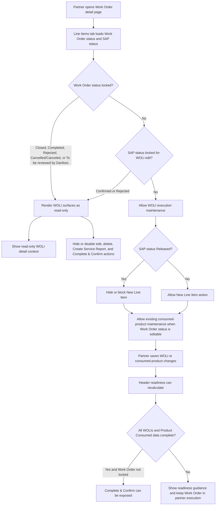

# WOLI Read-Only Conditions in Danfoss Connect

## Process Description

### Process Definition

This process defines when Danfoss Connect partner users can edit Work Order Line Item (WOLI) execution details and when WOLI surfaces become read-only. The rule protects completed, rejected, cancelled, closed, or Danfoss-review Work Orders from partner-side changes while still allowing partners to complete necessary execution data before the Work Order is released or handed off.

### Process Scope

The scope covers DD and DCS partner users working from the Danfoss Connect Work Order detail page, especially the Line Items tab, WOLI detail popup, consumed-product grid, line-item creation action, service-report action, and header-level Complete & Confirm action.

The process applies to:

- Existing Work Order Line Item detail review and editing.
- Product Consumed maintenance for existing WOLIs.
- Creation of new WOLIs from the Work Order Line Items tab.
- Removal of partner-created WOLIs.
- Visibility of downstream actions such as Create Service Report and Complete & Confirm.

Out of scope:

- Back-office Danfoss user edit rules outside the partner Danfoss Connect experience.
- Standard Salesforce record-edit entry points not exposed through the Danfoss Connect partner UI.
- Final resolution of the SAP status implementation gap noted below.

### Business Rules

- A WOLI should be editable when the parent Work Order status is not `Closed`, `Completed`, `Rejected`, `Cancelled`/`Canceled`, or `To be reviewed by Danfoss`, and the SAP status is not `Confirmed` or `Rejected`.
- A WOLI should be read-only when the parent Work Order status is one of the locked business statuses or the SAP status is one of the locked SAP statuses.
- When the Work Order is locked, partners can inspect WOLI details but cannot edit WOLI data, add/delete line items, create service reports, edit consumed products, or complete and confirm the Work Order.
- When SAP status is `Released`, partners cannot add a new WOLI. However, if the Work Order status itself is not locked, partners can still maintain consumed products for existing WOLIs.
- SAP status `Cancelled` was removed from the acceptance criteria because it is not an available SAP status in this process context.

### Process Flow

## Technical Description

### Implementation Summary

The implemented behavior is split across partner-facing Lightning Web Components and the existing Apex controller used for WOLI retrieval and persistence. The UI surfaces load parent Work Order status and SAP status, then decide which partner actions are visible or editable. The Apex controller remains the persistence owner for WOLI data, but the visible create, remove, save, and detail-edit gates are applied by the LWC layer before partner users can invoke those actions.

The important design nuance is that not all SAP states have the same meaning. `Released` blocks new WOLI creation, but the story comments confirm that partners may still maintain consumed products for existing WOLIs when the Work Order business status is otherwise editable.

### Related Components

| Component                             | Type                                      | Implementation Detail                                                                                                                                                                                             |
| ------------------------------------- | ----------------------------------------- | ----------------------------------------------------------------------------------------------------------------------------------------------------------------------------------------------------------------- |
| `workOrderPartnerWoliDetailModal`     | LWC                                       | In-context WOLI detail popup. Shows full WOLI payload and disables save/edit behavior when the loaded Work Order or SAP context is treated as locked.                                                             |
| `workOrderPartnerCallManageCaseItems` | LWC                                       | Work Order Line Items tab shell. Loads Work Order status and `SAPStatus__c`, renders existing WOLI cards, and suppresses `New Line Item` when status rules block line-item creation.                              |
| `workOrderPartnerAddProduct`          | LWC                                       | WOLI summary and consumed-product card. Edits Product Consumed rows in eligible states, launches the detail modal, gates line-item removal, and gates Create Service Report.                                      |
| `WorkOrderLockUtils`                  | LWC utility / shared lock logic reference | User-provided related component. No standalone local wiki artifact was found during this documentation pass; treat it as the shared status-rule utility reference if present in the delivered package.            |
| `workOrderBanner`                     | LWC                                       | Header-level Work Order readiness and Complete & Confirm component. Stops exposing Complete & Confirm once the Work Order has already reached a completed, closed, rejected, canceled, or Danfoss-review state.   |
| `WorkOrderPartnerController`          | Apex                                      | Server-side retrieval and persistence owner for partner WOLI data, product data, picklist data, and line-item save/delete paths. UI lock gates are applied before partner users invoke controller-backed actions. |

### Detailed Technical Behavior

1. The Work Order Line Items shell loads the parent Work Order `Status` and `SAPStatus__c`.
2. The shell evaluates whether the `New Line Item` action should be displayed.
3. If Work Order status is `To be reviewed by Danfoss`, the shell suppresses new-line-item creation and passes non-editable context to WOLI cards.
4. If SAP status is treated as blocking creation, including the implemented `Released` path, the shell suppresses `New Line Item`.
5. Existing WOLIs render through `workOrderPartnerAddProduct` cards.
6. In editable Work Order states, `workOrderPartnerAddProduct` allows Product Consumed field maintenance and captures in-progress edits before explicit save.
7. When the parent Work Order status is `To be reviewed by Danfoss`, consumed-product mutation controls are hidden from the card.
8. The WOLI detail popup loads the WOLI and parent Work Order context through GraphQL.
9. The modal renders detail fields as editable only when its status checks allow editing; otherwise, it remains an inspection surface with save disabled.
10. The Work Order banner continues to own header readiness and Complete & Confirm visibility. Once the Work Order is already in a terminal or review status, Complete & Confirm is not exposed.
11. `WorkOrderPartnerController` remains the server-side owner for WOLI retrieval and persistence, but the partner UI applies visibility and edit gates before users call those persistence paths.

### Wiki Alignment Notes

The following wiki pages were analyzed and used to align terminology, behavior boundaries, and component ownership:

- `wiki/concepts/work-order-line-item-management.md` establishes the main process owner for WOLI creation, detail review, product editing, removal, service-report entry, and status/SAP-stage gating.
- `wiki/artifacts/work-order-partner-woli-detail-modal.md` confirms the WOLI popup owns in-context detail review and mixed read-only versus editable rendering.
- `wiki/artifacts/work-order-partner-call-manage-case-items.md` confirms the Work Order Line Items shell owns current WOLI list rendering and the `New Line Item` gate.
- `wiki/artifacts/work-order-partner-add-product.md` confirms the WOLI card owns Product Consumed editing and the SAP `Released` nuance for existing WOLI maintenance.
- `wiki/artifacts/work-order-banner.md` confirms the header-level readiness and Complete & Confirm responsibility.
- `wiki/artifacts/work-order-partner-controller.md` confirms the Apex controller remains the server-side WOLI data and persistence owner.
- `wiki/concepts/work-order-complete-confirmation.md` confirms the relationship between WOLI/Product Consumed completeness and header readiness.

The wiki also records an implementation alignment question: the story confirmation names SAP `Rejected` as a lock status and treats SAP `Released` as a creation-only block, while the locally retrieved LWC checks show `Released` and `Confirmed` in several UI gates. This document preserves the story rule and flags the implementation gap as an assumption below.

### Assumptions and Open Points

- The user story is already implemented, as confirmed by the request.
- The attached component list is accepted as implementation evidence for related component scope.
- `WorkOrderLockUtils` is included as a user-provided related component, but no standalone local wiki artifact or local source file was found during this pass.
- SAP `Rejected` should be treated as a WOLI lock status based on story confirmation, unless product or implementation owners intentionally chose the current `Released`/`Confirmed` local UI gate set.
- SAP `Released` blocks new WOLI creation, but consumed-product maintenance can remain available when the Work Order business status is not locked.

### Validation Checklist

| Acceptance Criteria / Story Rule                                                                 | Documentation Coverage                                                               |
| ------------------------------------------------------------------------------------------------ | ------------------------------------------------------------------------------------ |
| Partner can edit WOLI details when Work Order status is not locked and SAP status is not locked. | Covered in Business Rules and Process Flow.                                          |
| Partner sees read-only behavior when Work Order status is locked or SAP status is locked.        | Covered in Business Rules, Process Flow, and Detailed Technical Behavior.            |
| Read-only state hides or disables edit-related downstream actions.                               | Covered through WOLI modal, add-product card, call-manage shell, and banner details. |
| SAP `Released` prevents adding a new WOLI.                                                       | Covered in Business Rules, Process Flow, and component table.                        |
| SAP `Released` still allows consumed-product maintenance when Work Order status is editable.     | Covered as the main process nuance and an explicit assumption.                       |
| SAP `Cancelled` is not part of the final SAP status rule.                                        | Covered in Business Rules.                                                           |
| Related components from the provided attachment are preserved.                                   | Covered in Related Components.                                                       |

## Sources

- `azure/US_2135466_onecrm_danfoss_connect_fix_the_conditions_that_make_the_woli_read_only/raw/work-item.json`
- `azure/US_2135466_onecrm_danfoss_connect_fix_the_conditions_that_make_the_woli_read_only/raw/attachments.json`
- `wiki/concepts/work-order-line-item-management.md`
- `wiki/artifacts/work-order-partner-woli-detail-modal.md`
- `wiki/artifacts/work-order-partner-call-manage-case-items.md`
- `wiki/artifacts/work-order-partner-add-product.md`
- `wiki/artifacts/work-order-banner.md`
- `wiki/artifacts/work-order-partner-controller.md`
- `wiki/concepts/work-order-complete-confirmation.md`
- User-provided component attachment in chat
